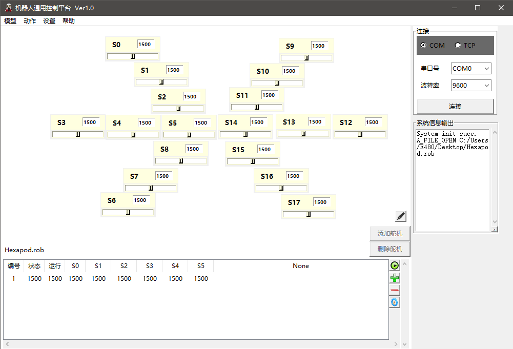

# RobotGeneralController
#### 软件名称

通用机器人控制器上位机。（以下简称`上位机`）

#### 上位机介绍

本软件为通用机器人控制器的上位机程序。

###### 具有以下特点：
1. 支持跨平台。目前已提供`Windows`、`Mac OS`、`Linux`系统的可运行程序。
2. 支持多国语言。目前已提供中、英、法、德、韩五中语言（存放在language语言包中）。
3. 支持各类外形的机器人。通过模块化组装的使用方式。
4. 集成常用的数据调试接口。如串口、TCP网口。
5. 此后将支持动态解析python脚本，以便使用人员个性化适配个人机器人。

#### 上位机实现方案

使用`python`开发，基于`tkinter`绘制页面。最后并使用`pyinstaller`打包成对应平台的可执行程序。

1. 使用python编写`pip3 install pillow pyinstaller -i https://mirrors.aliyun.com/pypi/simple/`
2. Linux下PIL安装`sudo apt-get install python3-pil python3-pil.imagetk`
3. GUI使用python下的tkinter
4. 使用pyinstaller打包程序 `pyinstaller --icon ./img/favicon.ico -w -F Controller.py configurator.py WindowElement.py  tkutils.py massagehead.py`

#### 文件介绍
1. src -> 源代码文件夹
	* `Controller.py` _为上位机的主程序控制器_
	* `WindowElement.py` _为GUI界面封装的子控件元素类的集合_
	* `massagehead.py` _为引擎与各个控件之间的消息头_
	* `configurator.py` _为处理配置文件类包_
	* `robotsocket.py` _为socket通信封装的服务器与客户端类_
	* `file_trans_manager.py` _基于robotsocket通信封装的文件传输管理类_
	* `init.cfg` _程序总配置文件_
	* `language` _程序语言包文件(定义了系统语言字体相关的信息)_
2. img -> 存放本软件涉及到的图标
	* 注：更改路径可以在`init.cfg`文件中system_init/imagepath下改
3. model -> 模型文件夹
	* `Hexapod.mo` _为六足机器人的预设模型_
	* `tmp.mo` _为测试模型_
4. action -> 动作组文件夹
	* 本目录暂时为空

#### 致谢
1. tkinter的Frame窗体设计参考了<https://blog.csdn.net/superfanstoprogram/article/details/83713196>

